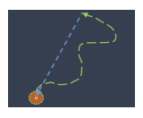
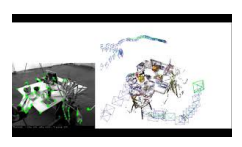
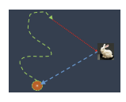
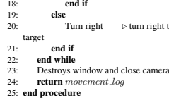
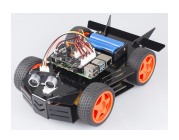
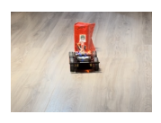

# 2024 Robotics Assignment Mobile Robot Challenge
### Team RoboRover: Suju Li, Shan Jiang, Jiayi Wu
### Dependence

- CV2
- numpy
### Quick start
#### Challenge 1:

Run `python3 challenge1.py` in the terminal to start.  
Press `W` to make the robot go forward, `A` to go left, `D` to go right, and `S` to go backward.   
Press `Q` to end control and navigate back to the origin.  

#### Challenge 2:

Run `python3 challenge2.py` in the terminal to start.  
Press `W` to make the robot go forward, `A` to go left, `D` to go right, and `S` to go backward.   
Press `T` to detect and touch the target, then the robot will automatically return to the origin.  
Press `Q` to end control.  

### Please find the test videos [here](https://github.com/LI-SUJU/MobileRobotChallenge/tree/main/videos).
### Please find a nicely formatted report [here](https://github.com/LI-SUJU/MobileRobotChallenge/blob/main/Robotics2024_Final_Project_by_RoboRover/Mobile_Robot_Challenge_by_RoboRover.pdf).

## Abstract

This report details the execution and outcomes of the Mobile Robot Challenge, undertaken by Team RoboRover, which utilized a robot equipped with a Raspberry Pi processor to navigate and interact with its environment effectively. The challenge comprised two primary tasks: autonomous return to origin and object recognition followed by navigation. The team utilized color detection techniques for enhanced interaction capabilities.

This study evaluates the technological implementations, discusses their efficacy, and explores the potential improvements for future iterations of robotic challenges.

## 1. Introduction

In this assignment, we use a robot equipped with a raspberry chip to complete two challenges. The first challenge was to manually maneuver the robot some distance away from its origin and then the robot was able to automatically return to its origin, as shown in Figure 1.

The second challenge was to manually command the robot

to move a distance away from the origin and then return to the origin after the robot was able to recognize a specific object, approach and almost touch the object, as shown in Figure 2.

## 2. Methodology1 2.1. Attempt 1: Based On Slam

Since this mission only allows a monocular camera mounted

on the robot, our team preferred Visual SLAM technology for implementation.

Visual SLAM (Simultaneous Localization and Mapping) is a technology that utilizes visual information for simultaneous localization and map construction. It captures environmental images through a camera and uses algorithms for environment perception and self-localization. Figure 3 is a simple example of Visual SLAM.

The core components of Visual SLAM include feature extraction, feature matching, motion estimation, map updating, loop closure detection, and optimization. These components are well-suited for the tasks we aim to accomplish. Therefore, we decided to use a Visual SLAM library for our initial attempt to tackle this challenge.

Among the many available Visual SLAM libraries, the ORBSLAM series is relatively well-known. Since our team

members are more familiar with Python, we chose to use third-party libraries based on ORB that support Python syntax, specifically SLAMpy-ORBSLAM, as our experimental configuration library.

1All the detailed implementation could be found in our GitHub repository.

## 2.2. Attempt 2: Based On Color Detection

2.2.1. MOVEMENT LOGS
MAINTAINING&BACKTRACKING
When the robot performs these four actions (forward, backward, turn left, turn right), we record these actions in the log, as shown in Algorithm 1. When we want to back-

Algorithm 1 Movement Logs Maintaining running = True 2: movement logs = []
while running do 4: key = **procedure** READKEY()
if key == q **then**
6: running = false key in [w, s, a, d]
start time = time.time()
8: action = {w: forward, s: backward, a: turn left, d: turn right}[key]
move(action, 5)
10: duration = time.time() - start time movement logs.append((action, duration))
12: **end if**
end while
track through all the steps, we change the action of each element inside the array movement *logs*: change *forward* to backward, backward to forward, turn left to turn *right*,
turn right to turn *left* ... and then execute from the end of the array to the beginning of it so we can walk back to the origin. This process is demonstrated in Algorithm 2.

## 2.2.2. Target Searching And Approaching

We are using color to detect the target object. In this case, we are detecting the red color in the image that the camera captures in real time and using OpenCV to find the contours of the target.

Once we detect the target in the image, we attempt to touch it. We achieve this by computing the target's width percentage in the image and its position. If the target is placed on the left side of the image, it means the robot is facing the right side of the target, so we have the robot turn left slightly. Similarly, the robot turns right when the target is on the right side. The robot loops to adjust its angle until the target is at the center, indicating that the robot directly faces the target; then, it moves forward.

Since every movement of the robot may introduce an error, we take several measures to eliminate the influences of these errors. First, when the robot is far from the target, a slight change in the robot's angle can significantly affect the position of the target in the image, thus making it challenging to find the exact angle that places the target at the center. To overcome this, we set a larger tolerance value in the function

Algorithm 2 Movement Logs Backtracking procedure MOVE
if action == forward **then**
3: fc.forward(power val)
end if if action == backward **then**
6: fc.backward(power val)
end if if action == turn left **then**
9: fc.turn left(power val)
end if if action == turn right **then**
12: fc.turn right(power val)
end if fc.stop()
15: **end procedure**
reverse commands = {forward: backward, backward: forward, turn left: turn right, turn right: turn left}
while movement logs do 18: action, duration = movement logs.pop()
procedure MOVE(reverse commands[action], 5) time.sleep(duration)
21: **end while**
that detects if the target is centered, allowing the robot to move closer to the target before we reduce the tolerance value. This adjustment enables the robot to locate the target more accurately as it gets closer. Second, to eliminate the effects of floor reflections and other interference factors, we can adjust the range in the cv2*.inRange* function.

When the width of the target in the image is greater than 70% (we can adjust this value to control the closest distance between the robot and the target), we assume that the robot has touched the target. Then, we use the same method as in Challenge 1 to return the robot to the origin. For more comprehensive understanding, please refer to the Algorithm 3.

## 3. Experiment 3.1. Indoor Environment

Lighting In all experiments, we closed the curtains and used two indoor light bulbs as light sources, which ensured the stability of the brightness and avoided the influence of outdoor sunlight.

Floor During the experiment (shown in the example videos),
the robot walks on a regular wooden floor, which will have a much different coefficient of friction than the ceramic floor of the classroom in the demo show. Therefore it may lead to some errors.

Algorithm 3 rotate move rotate touch Algorithm 1: **procedure** ROTATE MOVE ROTATE TOUCH
2: Initialize camera with 640x480, RGB888 3: Start camera 4: **while** ¬is *touch* do 5: Capture image img 6: img ← color detect(img,′red′)
7: Calculate is item present, center *state*,
width *percentage* from img and *contours* 8: if is item *present* **then** 9: if width *percentage <* 0.2 **then**
10: Check center state, set tolerance = 60 11: Adjust rotation ▷ turn left, right, or forward 12: **else if** width *percentage >* 0.7 **then**
13: Stop the Robot 14: Set is *touch* = True 15: **else** 16: Check center state, set tolerance = 20 17: Adjust rotation

Target Object For the second challenge, we used a red rectangular cardboard box with a length, width and height of about 5*5*9cm.

## 3.2. Hardware&Software Environment

3.2.1. HARDWARE

Regarding hardware, we chose the PiCar-4wd Car Kit produced by SunFounder, equipped with a Raspberry Pi 3 and a monocular camera. In addition, the package includes a Web terminal operation interface and some Python codes that support obstacle avoidance and line tracking functions. From the outside, it looks like a four-wheel-drive car equipped with a Raspberry Pi board with a hardware interface. A
monocular camera is installed on the front of the car, and its pitch angle can be adjusted manually to adapt to different experimental needs. Figure 4 shows a simple example of the appearance of the SunFounder PiCar-4WD Car Kit for Raspberry Pi.

In addition, during our experiment, to install the required dependent environment, we used a network cable to connect the Raspberry Pi to the router to achieve the Internet access function.

## 3.3. Software Environment

In order to avoid environmental chaos and the need to reinstall the Raspberry Pi operating system, we built an isolated experimental environment in the Raspberry Pi. In this virtual environment, we use the Python that comes with the system as the interpreter. The robot component has a built-in picar 4wd library to control motor operation and implement basic operations such as forward and backward. For our first challenge, we tried writing our keyboard control code to capture keypress times. However, since the Keyboard library in Python requires root permissions to run, and the library is installed in our virtual environment when we call it with root permissions, calling the Python interpreter in the system root directory will cause packet loss errors. Therefore, we decided to adapt based on the code that comes with the machine instead of rewriting this part of the code.

## 4. Results 4.1. Attempt 1: Based On Slam

During the process of configuring the environment, we encountered significant difficulties. Although, as mentioned above, we tried to configure two third-party libraries based on ORB-SLAM - system and SLAMPy-ORBSLAM, we encountered major challenges during the configuration process.

These third-party libraries were last updated 4 to 7 years ago, resulting in serious environment compatibility issues.

Some dependent versions have stopped being maintained and cannot even be downloaded. Ultimately, our installation attempt failed because we could not successfully configure these dependencies.

Subsequently, we decided to install and configure ORBSLAM. However, the Raspberry Pi 3 mounted on the car cannot meet the computing power requirements of Visual SLAM. The car travels slowly, consumes abnormal power, and the machine is seriously hot, which clearly shows that it is unrealistic to configure the library on the car. Usually, in this case, we can deploy the environment locally, transfer the images captured by the camera to the computer for calculation and analysis, and then transmit the action decision back to the robot. However, we ultimately gave up on using Visual SLAM for this task because this approach was too cumbersome, and we were limited on time.

## 4.2. Attempt 2: Based On Color Detection2 4.2.1. Challenge 1

As we change our strategy to backtracking the path, we achieve obvious progress. After we operate the robot with commands, the robot can accurately return to the origin, as shown in Figure 5.

## 4.2.2. Challenge 2

In challenge 2, the robot runs with the command input in the terminal. The user can press the "T" key to make the robot start detecting the target object. The robot can approach and touch the target and then return to the origin with a slight distance error. The more time the robot takes to find the target, the greater the distance error when it returns to the origin. This happens because each move of the robot, even with the same interval and angle, differs slightly. The more the robot moves, the more these differences accumulate.

Besides that, we also eliminate the interference of the target

object's reflection on the floor by adjusting the color detection parameters. By tuning the saturation and brightness of the detection function, we can eliminate the effect of other elements.

## 5. Analysis

The methodologies adopted by Team RoboRover, particularly the use of color detection, represent a significant stride toward integrating complex computer vision techniques with real-time robotic control. Color detection algorithm facilitated the robot's interaction with objects based on their color attributes while simultaneously tracking its own movements.

This approach was crucial for the robot's ability to return to its starting point autonomously.

2Test videos for both challenges could be found here.

## 6. Limitations

Despite the successes reported, several limitations were evident in the study:
Hardware Constraints The reliance on a monocular camera limits depth perception, which is critical for more nuanced navigation and interaction tasks.

Environmental Dependency The performance of color detection algorithms is highly contingent on environmental conditions such as lighting and the presence of distinct visual features.

Error Accumulation Inherent in our movement backtracking technologies, error accumulation over time can lead to significant deviations in mapping and localization, affecting long-term reliability.

Generalization The algorithms' ability to generalize to different environments or tasks without extensive reconfiguration remains questionable.

## 7. Conclusion And Future Work

The Mobile Robot Challenge showcased the effective application of advanced algorithms in a practical robotics context, with Team RoboRover demonstrating significant proficiency in employing Visual SLAM and color detection techniques.

The robot successfully navigated to and from a designated origin point and interacted with specific objects based on visual cues. However, the challenges highlighted crucial areas for improvement, particularly in enhancing the robustness and adaptability of the systems used.

To address the current limitations and enhance future implementations, several areas of development are recommended:
Enhanced Sensory Hardware Integrating stereo cameras or LIDAR could improve depth perception and environmental mapping accuracy.

Algorithm Optimization Developing less resourceintensive algorithms could allow for smoother operation on limited-capacity processors.

Adaptive Lighting Solutions Incorporating adaptive algorithms that can adjust to varying lighting conditions would make the system more robust to environmental changes.

Error Correction Mechanisms Implementing advanced error correction techniques in SLAM could reduce cumulative mapping errors. Cross-Environment Generalization Future studies should focus on creating more adaptable models that can perform across a broader range of environments and tasks without needing extensive retraining.

## 8. Appendix

All dependencies and instructions for running the code could be found in the README file in our GitHub repository. You can click **here** to access it.
